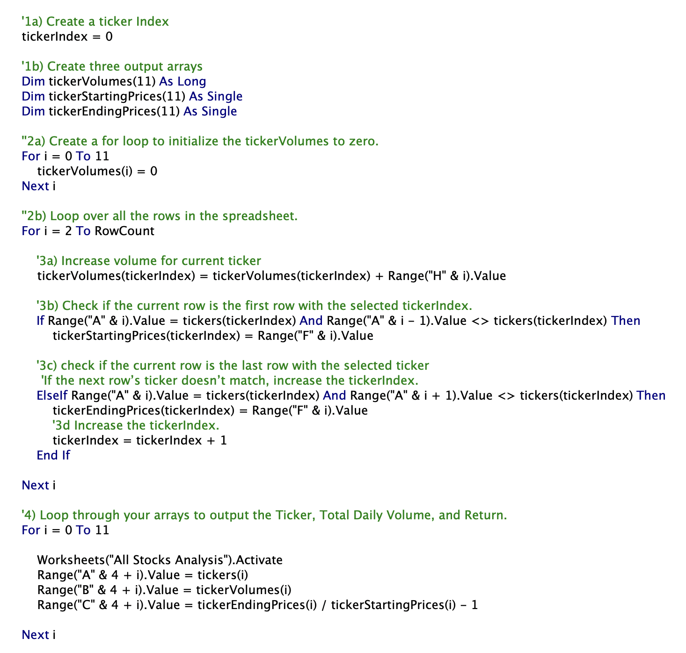
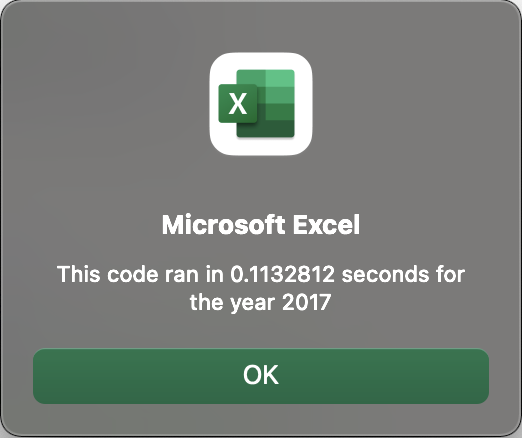
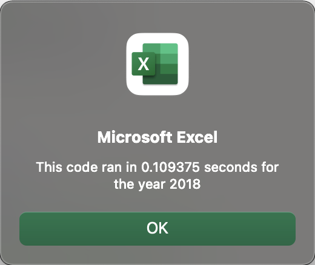

# Stock Analysis

## Project Overview
This project analyzes a dataset which includes stock data. The purpose of analyzing the dataset is to see which stocks are worth investing in based on their total daily volume and return.

## Results
Using the following code, we were able to pull 12 different stocks and their total daily volume and their return:

For the list of stocks in 2017, the highest rate of return was 'DQ' while the lowest was 'TERP'. One can conclude from this data that 'DQ' would've been a great investment while 'TERP' not so much.

For the list of stocks in 2018, the highest rate of return was 'RUN' while the lowest was 'DQ'. Comparing the 2 sets of data from 2017 and 2018, it can be concluded that overall stocks performed much better in 2017.

Both years provided an efficient macro runtime of around 0.11 seconds - about 6 times faster than the original code we started with. Below shows the exact runtimes for each session:
.png)
.png)

## Summary

### Advantages of Refactoring Code
There are always several ways in which a program can be written. Because of this, it is more than likely the original code contains some inefficiencies. It is always best practice to review code and determine if it can be simplified not only for the sake of a more efficient program, but for better readability from a programmers standpoint.

### Disadvantages of Refactoring Code
The problem with refactoring in the real world, however, is time. Every project has a budget and time must be utilized properly to make deadlines and not exceed budgets.
